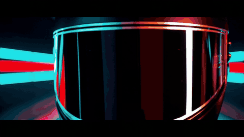
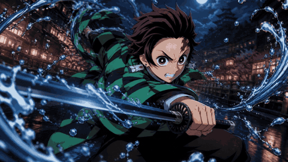
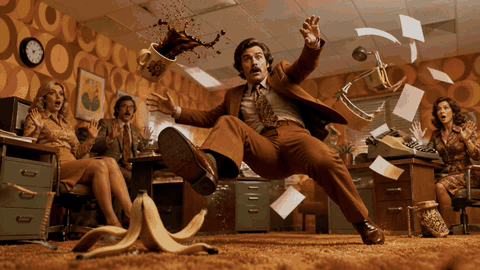
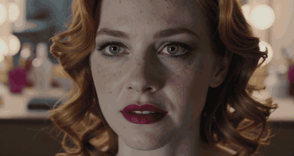
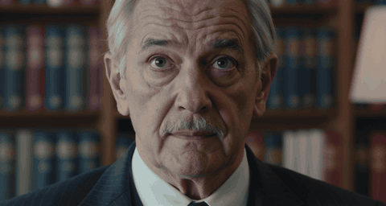
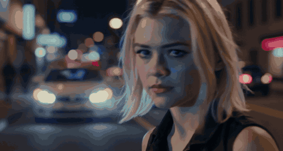

# LTX Video Prompt Gallery

This folder collects LTX video prompt experiments, prompt-writing notes, and generated video outputs.

Open this README on GitHub to watch animated GIF previews inline. Click any preview to open the full MP4 video.

## Generated Videos

### Video 1: Neon Motorcycle Racer

[](./src/1.mp4)

**Prompt**

```text
A charismatic female racer in a black leather suit stands beside a futuristic motorcycle in a dark neon tunnel. She removes her helmet in one confident motion, revealing sharp eyes and wind-tossed hair as the tunnel lights ignite behind her in a rapid wave of electric color. The camera begins in a tight close-up on the helmet, then pulls back smoothly into a clean wide hero shot with the bike and glowing tunnel perfectly framed. Strong contrast, glossy surfaces, neon cyan and red highlights, subtle haze, bold premium commercial look, instantly readable and scroll-stopping. Electric hum, distant engine echo, soft reverb in the tunnel, no text, no logos, no watermark.
```

### Video 2: Anime Sword Attack

[](./src/2.mp4)

**Prompt**

```text
Use the provided image as the exact first frame. The character continues his sword attack in a fast, dynamic motion. Water effects swirl and expand around the blade, following the movement. The camera performs a slight forward push combined with a subtle rotation to enhance intensity. Add motion blur on fast movements while keeping the character sharp. Cinematic anime lighting, high energy, 16:9
```

### Video 3: 1970s Office Bullet Time

[](./src/3.mp4)

**Prompt**

```text
Use the provided image as the exact first frame and preserve the original composition, framing, character positions, lens perspective, 1970s office set, colors, costumes, objects, and lighting.

Animate this single frozen moment as a cinematic bullet-time effect.

The man remains suspended mid-air after slipping on the banana peel. His shocked face, body pose, legs, arms, and suit must stay consistent with the first frame.

The camera performs a very subtle bullet-time move while preserving the same wide composition: a slow lateral orbit/parallax move around the frozen action, as if the camera is gliding slightly from left to right around the room. The movement should feel smooth, controlled, and physically realistic, not like a new camera angle.

Time is almost frozen.

Only tiny micro-movements are visible:
- coffee droplets wobble and stretch slightly in mid-air
- floating papers rotate very slowly
- the desk lamp swings almost imperceptibly
- the typewriter and office objects remain mostly fixed
- the banana peel barely shifts in the carpet
- the man's fingers tremble slightly
- his suit fabric moves subtly
- his eyes stay wide open with a tiny facial twitch
- background coworkers remain frozen with minimal breathing-like motion

Maintain the original warm orange 1970s cinematic lighting, realistic shadows, shallow depth, and vintage office atmosphere.

No sudden motion.
No time resume.
No falling.
No impact.
No new characters.
No new objects.
No scene change.
No camera cut.
No close-up.

Pure suspended comedic chaos in ultra slow-motion bullet time, based exactly on the provided image.

16:9, cinematic realism, no text, no logo.
```

### Video 4

[](./src/4.mp4)

Prompt not documented yet.

### Video 5

[](./src/5.mp4)

Prompt not documented yet.

### Video 6

[](./src/6.mp4)

Prompt not documented yet.

## Prompting Guide

Strong LTX prompts describe the whole shot, not just the subject. Include:

- **Subject:** who or what is in the scene.
- **Action:** what changes over time.
- **Environment:** location, era, set dressing, weather, and atmosphere.
- **Lighting:** color, contrast, time of day, reflections, shadows, and haze.
- **Camera behavior:** close-up, wide shot, tracking shot, push-in, orbit, handheld, macro, low angle, or shallow depth of field.
- **Motion constraints:** what should move, what should stay fixed, whether movement is slow, fast, subtle, or dramatic.
- **Audio:** relevant sound design when the endpoint supports synchronized audio.
- **Exclusions:** text, logos, watermarks, cuts, new objects, or unwanted scene changes.

## Prompt Templates

### Text-to-Video

```text
[Subject] in [environment] performs [action].
The camera [camera movement/framing].
Lighting is [lighting style], with [color/texture/atmosphere].
The motion should feel [pace/energy/realism].
Audio: [sound design], if supported.
No [unwanted elements].
```

### Image-to-Video

```text
Use the provided image as the exact first frame.
Preserve [composition, character identity, framing, perspective, lighting, colors, and key objects].
Animate [specific subject/action] with [motion style].
The camera [subtle movement or locked-off behavior].
Keep [important elements] consistent.
No [unwanted motion, cuts, new objects, text, logos, or scene changes].
```

### Bullet-Time / Frozen Moment

```text
Use the provided image as the exact first frame and preserve the original composition.
Animate this single frozen moment as a cinematic bullet-time effect.
Time is almost frozen.
Only tiny micro-movements are visible: [list small details].
The camera performs [subtle orbit/parallax/push].
No sudden motion, no impact, no scene change, no camera cut.
```


